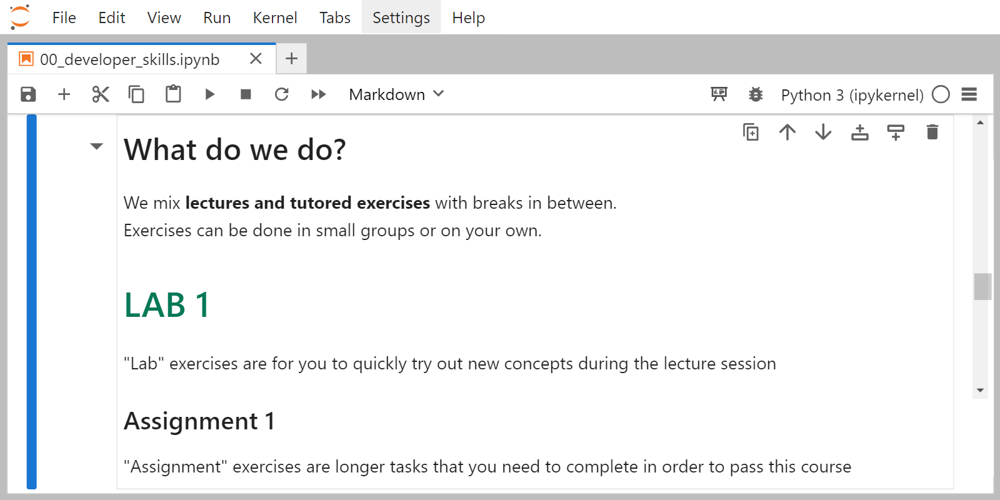
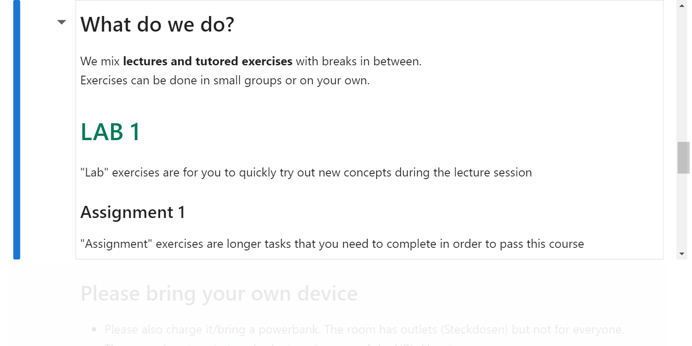
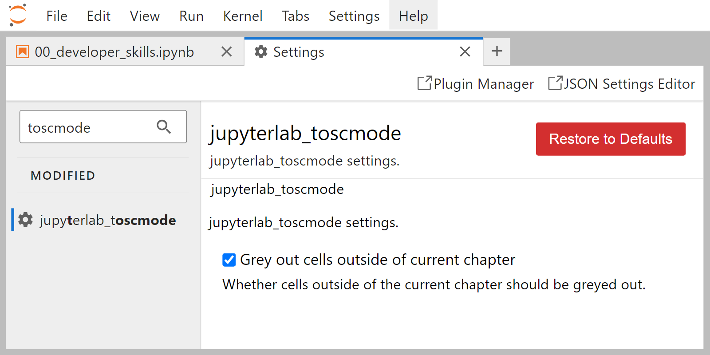

<!-- badges: start -->
[](https://github.com/toscm/toscmode/actions/workflows/build.yml)
<!-- badges: end -->

# jupyterlab_toscmode

JupyterLab v4.x extension providing command *Enable Showcase Mode* that allows to switch between normal mode and showcase mode. In Showcase Mode, the following elements are hidden:

-   The menu panel (at the top of the screen)
-   The notebook panel (at the top of the notebook)
-   The cell toolbar (inside the currently selected cell)
-   Optional: cells not part of the currently selected chapter (requires option `Grey out cells outside of current chapter` to be set to true)

## Installation

Execute the following command in a shell:

```bash
pip install jupyterlab_toscmode
```

Or install it via the grafical extension manager as shown below:


## Usage

1. Enter `Ctrl+Shift+D` to switch to the "Simple Interface", i.e. no tabs are shown.
2. Enter `Ctrl+Shift+C` to open the Command Panel and run command "Toggle Showcase Mode".
3. To switch back to normal mode, repeat.

<div style="display: flex; justify-content: space-between;">
  
  
</div>

## Configuration

### Enable cell grey out

1. In Jupyter, go to Settings tab -> Settings editor
2. Enter `toscmode` in the search bar
3. Enable/diable setting `Grey out cells outside of current chapter`



### Set custom Shortcuts

1. In Jupyter, go to Settings tab -> Settings editor
2. Choose `Keyboard Shortcuts` from the left sidebar
3. Open the JSON Settings Editor in the top right corner
4. Edit the User Preferences on the right and save. The following is a template to quickly toggle between full functionality (Menu bars enabled) and Showcase mode (Menu bars disabled) with the following maps:
    - `Ctrl+Shift+1`: toggle left sidebar
    - `Ctrl+Shift+2`: toggle simple interface (Jupyter tabs)
    - `Ctrl+Shift+3`: toggle Showcase mode
5. Save changes. Reload browser to activate.

```
{
    "shortcuts": [
        {
            "args": {},
            "command": "application:toggle-left-area",
            "keys": [
                "Ctrl Shift 1"
            ],
            "selector": "body"
        },
        {
            "args": {},
            "command": "application:toggle-mode",
            "keys": [
                "Ctrl Shift 2"
            ],
            "selector": "body"
        },
        {
            "args": {},
            "command": "jupyterlab_toscmode:toggle-showcase-mode",
            "keys": [
                "Ctrl Shift 3"
            ],
            "selector": "body"
        }
    ]
    
}
```


## Contribute

See [CONTRIBUTING.md](CONTRIBUTING.md) for details on how to contribute to this project.
